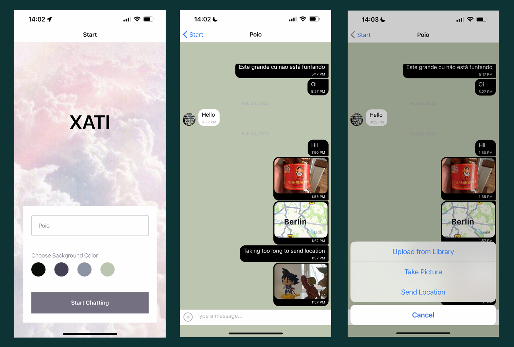

# Chat App - XATI

This is a Chat app built with React-Native, React native AsyncStorage Api, Expo, Google Firebase, and GiftedChat. 
The app allows users to enter their names, choose a background color, send and receive messages, send images, take photos and share geo-location. 
The app stores data offline and enables anonymous authentication on Google Firebase.


## Screenshot
<p align="center">
 
</p>

## Key Features

* User can enter their name and choose a background color.
* User can send and receive messages in real-time.
* User can send images, take photos, and share their geo-location.
* Data is stored offline using React native AsyncStorage Api.
* Anonymous authentication is enabled on Google Firebase.

## Installation

To run the Chat App on your local machine, please follow these instructions:

1. Clone the repository to your local machine.
`git clone https://github.com/username/chat-app.git`

2. Install the dependencies using npm or yarn.
`npm install`

3. Create a Firebase project and enable anonymous authentication.

4. Add the Firebase configuration to the app by creating a firebase.js file in the config folder and adding the following code.
```import firebase from 'firebase/app';
import 'firebase/firestore';
import 'firebase/auth';

const firebaseConfig = {
  apiKey: '<YOUR_API_KEY>',
  authDomain: '<YOUR_AUTH_DOMAIN>',
  projectId: '<YOUR_PROJECT_ID>',
  storageBucket: '<YOUR_STORAGE_BUCKET>',
  messagingSenderId: '<YOUR_MESSAGING_SENDER_ID>',
  appId: '<YOUR_APP_ID>',
};

if (!firebase.apps.length) {
  firebase.initializeApp(firebaseConfig);
}

export { firebase };
```

5. Run the app using Expo.
`expo start`

## Extra Information
This app was built as a part of a React Native course and is not intended for commercial use. 
Please feel free to fork and modify the app to suit your needs. If you encounter any issues or have any suggestions, 
please create an issue or submit a pull request.


